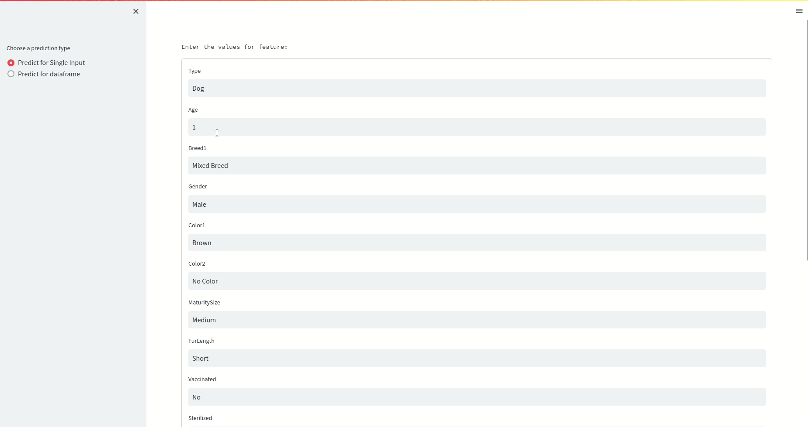

# Petfinder Classification task

This repository contains code to train XGBoost model using Petfinder dataset.

### Requirements

  - Python3.10 (tested on python3.10)
  - conda (optional)

### Installation

#### Install using conda

If you have conda, go to the root of the repo and use the following command to create a conda environment:

```shell
conda env create -n myenv -f environment.yml
conda activate myenv
```

#### Install using python virtual environment

If you are using python virtual environment, go to root of the repo after activating the environment, and install the dependencies using the following command:

```shell
pip install -r requirements.txt
```

### Directory structure

├── artifacts           # contains model and charts

├── tests               # contain pytests for data, training and predictions

├── test.sh              # script to run tests

├── app.py              # streamlit demo

├── environment.yml     # conda environment file

├── requirements.txt    # python dependencies file

├── evaluation.py       # python script to evaluate model

├── evaluation.sh       # bash script to run evaluation.py

├── train.py            # python script to train the model

├── train.sh            # bash script to run train.py

├── run.sh              # script to run training, evaluation and tests at once

└── ...


### Running the script

To run the entire script, go to the root of the repo and use the following command:

```shell
./run.sh
```

To run individual scripts, use the following command:

```shell
./train.sh
./evaluation.sh
./test.sh
```

##### train.sh

  - Reads the input from "gs://cloud-samples-data/ai-platform-unified/datasets/tabular/petfinder-tabular-classification.csv" and loads into Pandas DataFrame
  - Split the dataset into 3 splits: train, validation and test with ratios of 60 (train) / 20 (validation) / 20 (test)
  - target column: `Adopted`, input features: rest all columns
  - Train ML model using XGBoost to predict whether a pet will be adopted or not. Uses validation data to perform early stopping
  - Log the training process to train.log with accuracy, f1, recall and precision score evaluated on test split of dataset


##### evaluation.sh

  - Reads the input from "gs://cloud-samples-data/ai-platform-unified/datasets/tabular/petfinder-tabular-classification.csv" and loads into Pandas DataFrame
  - Uses the model you trained in the previous step to score all the rows in the CSV
  - Save the output into output/results.csv (output/* is git ignored)


##### test.sh

  - running pytests 


### Demo

To run the demo, use the following command:

```shell
streamlit run app.py
```



### Next steps

  - Using [DVC](https://dvc.org/) for storing artifacts
  - Improving the model accuracy
